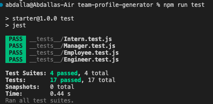

# Team Profile Generator [](https://opensource.org/licenses/MIT)
  
  ## Table of Contents
  * [Description](#Description)
  * [Installation](#Installation)
  * [Usage](#Usage)
  * [License](#License)
  * [Contribution](#Contributing)
  * [Test](#test)
  * [Credit](#credit)
  * [Questions](#questions)

  ## Description 
  An application to generate a team profile html page based on user inputs. The application includes three types of employees; manager, engineer and intern. The fields required to fill differ between the three employee types. 

  ## Installation
  The application is run by node, inquirer packages. It also includes unit testing for the employees therefore, jest installation is required. When the application is run for the first time and node as well as npm are installed run ```npm init -y``` to generate packages.json file. Make sure you are in the main folder where index.js file is located. Then install inquirer package version 6.5.0 by running ```npm i inquirer@6.5.0```. Now all dependencies are installed.

  ## Usage
  Simply run ```node index.js``` to start the application. The user will be presented with first with manager prompts, follow the prompts then the user will be presented with a choice either to add another employee e

  ## License
  [](https://opensource.org/licenses/MIT)

  ## Contributing
  Please refer to each project's style and contribution guidelines for submitting patches and additions. In general, we follow the "fork-and-pull" Git workflow. NOTE: Be sure to merge the latest from "upstream" before making a pull request!
  
  ## Test
  Run ```npm run test``` to perform unit testing included in the application. There are three files to test the behaviour of employee classes (Manager, Engineer and Intern).

  ### ScreenShot of a successful test run.

  .
  
  ## Credit
  Regular expression pattern for [email validation function](https://github.com/abdalla-diaai/team-profile-generator/blob/37c4ff14e0994ad5eaf2d27c3195a29e5efd476f/index.js#L17C1-L24C1) was obtained from [this article](https://www.abstractapi.com/guides/email-validation-regex-javascript). 
   
  ## Questions
  Check my GitHub profile or get in touch if you have any questions by clicking on contact link below to send me an email. 

  [GitHub Profile](https://github.com/abdalla-diaai)

  [Contact Email](mailto:abdalla.diaai@outlook.com)
  
